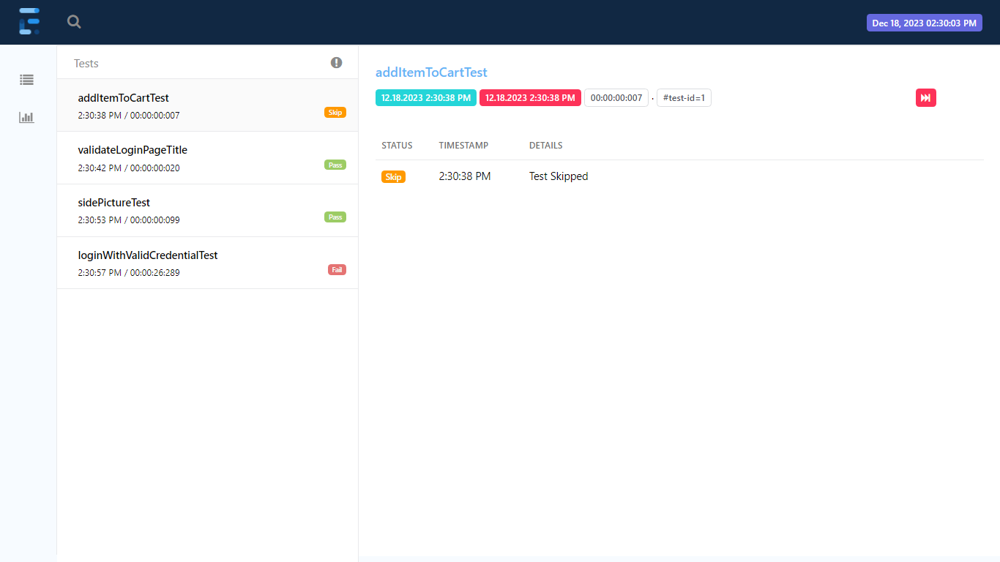

# Web Automation Testing for SauceDemo

This README overviews a web automation testing project for the SauceDemo web application. The testing is focused on the login page and the logout functionality from the home page of the website, which is accessible at [https://www.saucedemo.com/v1/index.html](https://www.saucedemo.com/v1/index.html).

## Table of Contents
- [Introduction](#introduction)
- [Prerequisites](#prerequisites)
- [Getting Started](#getting-started)
- [Test Cases](#test-cases)
- [Test Execution](#test-execution)
- [Report](#report)

## Introduction
This web automation testing project is designed to verify the functionality of the SauceDemo web application. Specifically, it covers two primary areas: 

1. **Login Page**: Testing the login functionality to ensure users can successfully log in to the website.
2. **Home Page**: Testing the logout functionality from the home page to confirm that users can securely log out.

The automation tests have been created using Selenium WebDriver and TestNG. They will run in a web browser to simulate user interactions.

## Prerequisites
Before beginning, ensure the following prerequisites are met:

1. **Web Browser**: Have a compatible web browser installed (e.g., Chrome, Firefox, or Edge).
2. **WebDriver**: Download and install the appropriate WebDriver for the chosen browser.
3. **Automation Framework**: Set up an automation testing framework (e.g., Selenium) with TestNG.
4. **Programming Language**: Install the necessary programming language and IDE.
5. **Create a maven project.
6. **Dependencies**: Add necessary dependencies, such as Selenium, WebDriverManager, and TestNG.

## Getting Started
1. Clone this repository to a local machine.
2. Set up the automation environment with the required prerequisites.
3. Edit the `BasePage` script to use the appropriate WebDriver for the browser.TChromeDriver is used in this project for the Chrome browser.
4. Customize test data or parameters as needed, e.g., username and password for login tests.
5. Write or modify test scripts for the login page and logout functionality using TestNG annotations.

## Test Cases
The following test cases are covered in this web automation testing project:

### Login Page
1. Verify successful login with valid credentials.
2. Verify failed login with invalid credentials.
3. Verify that error messages are displayed for failed login attempts.

### Home Page
1. Verify successful logout from the home page.

**Note:** Some tests have purposefully failed to validate the error-handling capabilities of the application.

## Test Execution
Execute the test scripts using TestNG. Run the tests against the URL [https://www.saucedemo.com/v1/index.html](https://www.saucedemo.com/v1/index.html).
## Reports
### TestNG Default Report
After test execution, TestNG will generate detailed reports that include pass and fail results for each test case. These reports are  available in the project directory. TestNG default test report files will be shared for review.

### Extent Report 
ExtentSaprk report can be found under the resource folder in the root. It contains an html file detailing the tests.

### Allure Report 

For the allure report to be generated, allure must be installed in the system. And run the necessary commands to generate the report.

### ScreenShot of Extent Report

